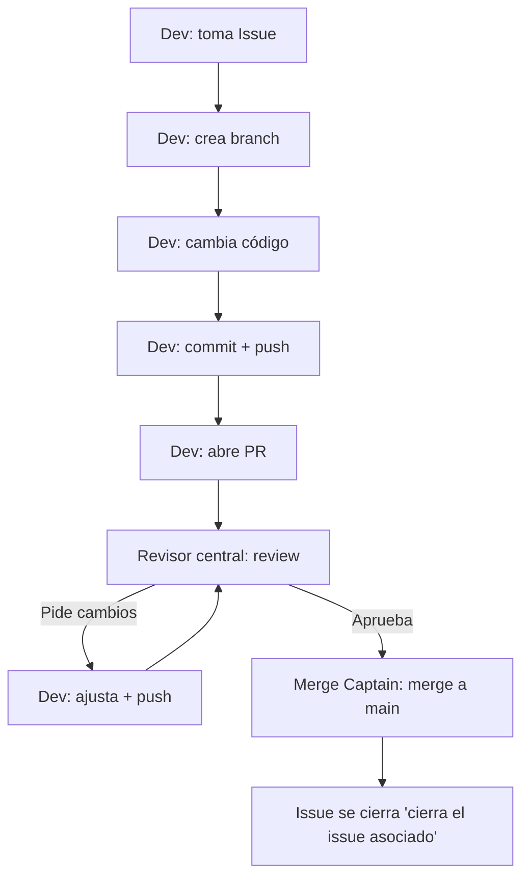

# Bug Zoo 🐛 — Taller práctico de Git + GitHub (1 hora)

Este repositorio es una mini app web (HTML/CSS/JS) creada para practicar trabajo colaborativo en GitHub:

* **Issues** (tareas)
* **Branches** (ramas)
* **Pull Requests (PRs)**
* **Code review** (revisión)
* **Merge** (integración a `main`)
* **Conflictos** (planificados y resueltos en vivo)

La app es el “escenario”: cada PR cambia algo que se ve rápido en el navegador.

---

## 1) Cómo ejecutar

* Opción A (simple): abrir `index.html` en el navegador.
* Opción B (recomendada): VS Code + extensión **Live Server**.

---

## 2) Roles (mesa central de merges)

A continuación se detallan los roles existentes en el taller:

### Roles

* **Docentes participantes (Devs):** toman un Issue, crean branch, hacen PR.
* **Revisores centrales (2–3 personas):** revisan PRs, piden 1 ajuste mínimo y aprueban.
* **Merge Captain (puede ser 1 de los revisores o el facilitador):** hace el **merge a `main`** cuando el PR esté aprobado.

✅ Reglas clave:

* Nadie se aprueba su propio PR.
* Nadie hace push directo a `main`.
* Cada PR necesita 1 revisión antes de merge.

> Opcional pro: activar “Branch protection” para exigir 1 aprobación antes de merge.

---

## 3) Reglas del taller

1. **Prohibido push directo a `main`.**
2. **1 Issue = 1 Branch = 1 PR.**
3. Todo PR debe tener **1 review** (comentario + aprobación).
4. Cambios **pequeños**, **visibles** y **mergeables**.
5. El PR debe referenciar el Issue (ej: `Closes #12`).

---

## 4) Flujo de trabajo (paso a paso)

### A) Elegir Issue

1. En GitHub → **Issues**.
2. Elige 1 Issue libre y **asígnate** (Assignees).

### B) Crear branch

```bash
git checkout -b feature/mi-tarea
```

### C) Cambiar código, commit y push

```bash
git add .
git commit -m "Mi cambio"
git push -u origin feature/mi-tarea
```

### D) Crear Pull Request

* Base: `main`
* Compare: `feature/mi-tarea`
* Incluye: qué cambiaste + cómo probar + `Closes #X`

### E) Review → ajustes → aprobación

* Un revisor central comenta y pide **1 ajuste mínimo**.
* Aplicas el ajuste y haces commit+push.
* Revisor aprueba.

### F) Merge

* Merge Captain hace merge.

---

## 5) Gráfico del flujo (Mermaid)



---